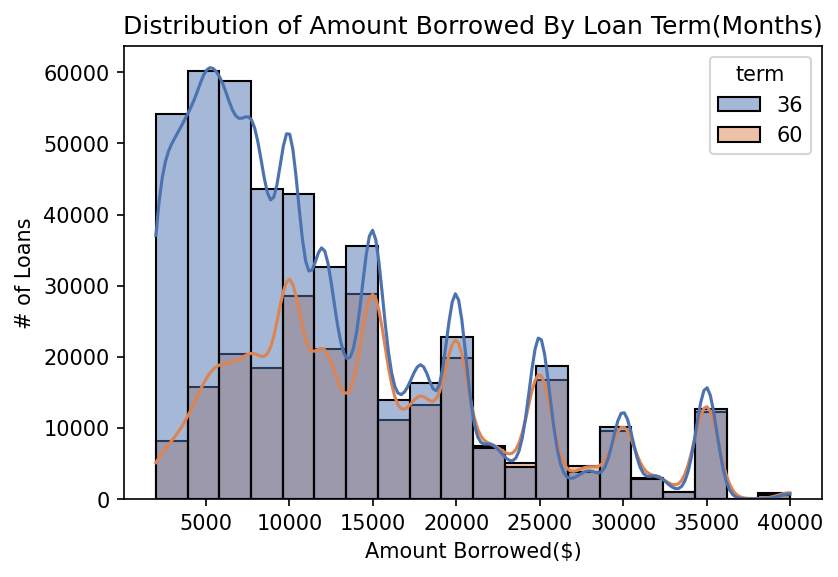
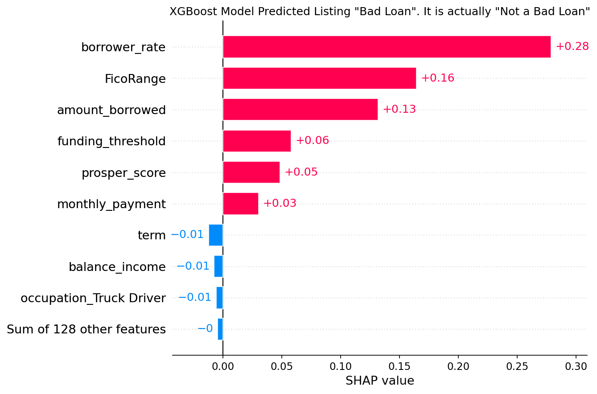
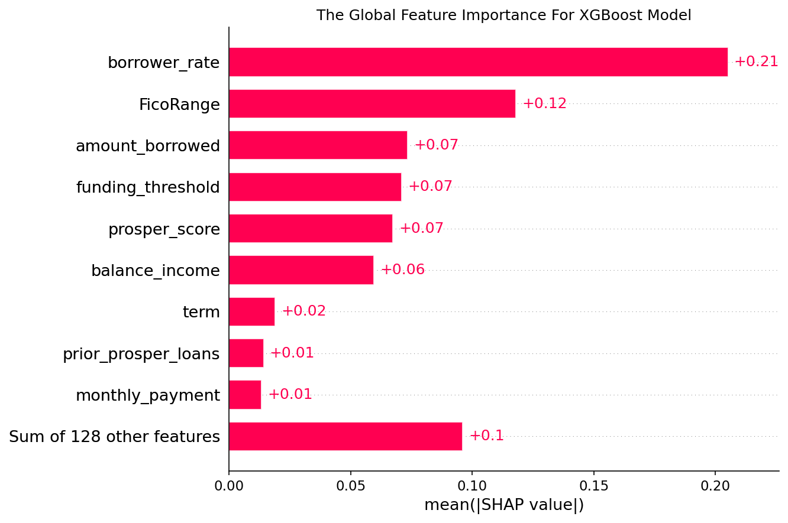

# Capstone Project Team Falcon
***

## Peer-to-Peer-Lending: Predicting Bad Loans with Machine Learning

****
## Table of Contents
<!-- no toc -->
- [1.	Introduction](#1introduction)
    - [a. Background](#a-background)
    - [b. Audience and Motivation](#b-audience-and-motivation)
- [2.	Data Acquisition](#2data-acquisition)
    - [a. Data source](#a-data-source)
- [3.	Methodology](#3methodology)
    - [a.	Data Preprocessing](#adata-preprocessing)
    - [b. Data Exploration](#b-data-exploration)
    - [c. SMOTE - Synthetic Minority Oversampling Technique](#c-smote---synthetic-minority-oversampling-technique)
    - [d.	Feature Engineering](#dfeature-engineering)
    - [c.	Machine Learning Models](#cmachine-learning-models)
- [4.	Results and Discussion](#4results-and-discussion)
    - [Dummy Classifier](#dummy-classifier)
    - [Logistic regression](#logistic-regression)
    - [Random Forest](#random-forest)
    - [XGBoost Classifier](#xgboost-classifier)
- [5.   Model Explainability (SHapley Additive exPlanations - SHAP)](#5---model-explainability-shapley-additive-explanations---shap)
    - [Feature Contributions (force plot)](#feature-contributions-force-plot)
    - [Global Explanations and Feature Importance](#global-explanations-and-feature-importance)
- [6.	Conclusion and Future Work](#6conclusion-and-future-work)
- [7.    Refrences](#7----refrences)

# 1.	Introduction 
### a. Background 
Peer-to-peer lending is an innovative FinTech product that disrupts the entire banking industry. Traditionally, banks play an intermediary role between borrowers and lenders. Banks collect money from lenders as deposits or savings at a lower rate, then issue loans to borrowers at a higher rate. To protect lenders’ money, banks execute the professional due diligence that distinguishes good borrowers from bad ones. Recently, peer-to-peer lending fintech firms invented a platform that connects lenders with borrowers without these intermediary banks. It gives an opportunity for lenders to earn more returns and for borrowers to get loans in a cheaper and quicker way. 
### b. Audience and Motivation 
Even though peer-to-peer lending platforms give tremendous opportunities to both parties, the solution itself has its own drawbacks. The professional due diligence work is on investors' shoulders.  Not all investors have the professional knowledge like banks to distinguish good borrowers from bad borrowers. Investors are regular people who want to earn a high return on their loans.  If they invest in a bad loan, they would lose their money.  

Prosper Lending enables investors to browse consumer loan applications containing the applicants loan details, credit history, etc in order to make determinations as to which loans to fund. Loans from applicants deemed at higher risk of default, such as those with lower FICO scores, will typically carry higher interest rates and therefore the potential to yield a higher return on investment for the investor. 

Alternatively, lower risk of default loans will usually carry lower interest rates. Therefore, a Machine Learning model that could accurately predict a bad loan (default risk of a loan) using the available data on Prosper Lending could help investors maximize their investment returns by identifying the loans worth investing. 

 Additionally, it would give opportunities to diversify portfolio of investors with high returns with high risks and low risks with low returns. 

# 2.	Data Acquisition 
### a. Data source
For our initial datasets, we use two separate datasets from [Prosper Marketplace, Inc](https://www.prosper.com). The first data is the Listing data.  The listing data includes information about all applicants. It includes personal features that can estimate the credit quality of borrowers. The are 886 qualitative and quantitative features per customer. 

The second data is the loan data.  The loan data includes actual loan information about applicants whose listings are approved and who received a loan from the Prosper Lending platform. The loan data has information about loan characteristics such as loan interest rate, loan amount, loan maturities, principal payments, balance, etc. 

Additionally, the loan data include our target feature, the loan status column. This column contains information that signifies if a loan is a bad loan (defaulted) or not a bad loan (completed). Some features in the listings and loan data are only relevant after loan issuance and are therefore not available to investors at the time of investing. We used the [Prosper Data Dictionary](https://www.prosper.com/Downloads/Services/Documentation/ProsperDataExport_Details.html) to better understand the features available to investors prior to a loan issuance.

# 3.	Methodology 

### a.	Data Preprocessing 
To begin, we executed a simple exploratory analysis using the data dictionary to find unique key identifiers to merge the listings and loans data. Both datasets have their unique key identifiers however, there is no direct connection between the unique identifiers. We decided to merge the two datasets with 6 common variables **(loan_origination_date, amount_borrowed, borrower_rate, prosper_rating, term, and co_borrower_application)**. We kept only uniquely merged rows as there might be two same borrowers who requested the same amount of loan and received the same loan interest and maturity. We filtered the data to only include loans from 2015 - 2021. After merging we had more that 80% unique matches between the 2 sources.

 Some of features in the data was dropped some based on these conditions;
  - variables with >50% of missing data 
  - variables that would introduce data leakage (eg age_in_months)
  - variables unavailable until loan issuance (eg days_past_due, late_fees_paid)
  - variables that include only one feature (eg scorex).

  *Missing Value Imputation*

We treated the missing values in all remaining features one by one;
- For numerical variables: imputation using mean or median
- For categorical variables: imputation using mode 

### b. Data Exploration
We created several exploratory data analysis plots using seaborn and plotly's Python library in order to build high-level intuition of some of the relationships between different features.

A plot of distribution of borrowed amount by loan term

The distribution is right skewed and also consistent with the fact that more people tend to pay smaller loans quickly

A plot of defaulting customers

We can see that a small percentage of customers are defaulting. This is a typical imbalanced dataset where the default rate is much lower than the successful completed rate. Machine learning algorithms applied to imbalanced classification datasets can produce biased predictions with misleading accuracies. We will use the SMOTE library to try mitigate this problem.

To avoid multicollinearity in the data, both numeric and categorial variables exhibiting high degrees of multicollinearity >0.85 were dropped from the dataset

### c. SMOTE - Synthetic Minority Oversampling Technique
We use the Synthetic Minority Oversampling Technique (SMOTE), which is a widely adopted approach, to address the class imbalance dataset. SMOTE uses bootstrapping and k-nearest neighnors to construct new minority class instances by transforming data based on feature space (rather than data space) similarities from minority samples. SMOTE performs a combination of oversampling and undersampling to construct a balanced dataset.

For our puposes we oversmapled the minority class to have 10% the number of examples of the majority class. We then used random undersampling to reduce the number of examples in the majority class to have 80% more than the minority class. Ratios are what works best for your data. We believe this ratio works best for us. As shown below we successfully generated a balanced dataset using smote.

### d.	Feature Engineering
We created two new features EMI (Equated Monthly Installment) and Balance_Income.

**EMI** - This is the monthly amount to be paid by the applicant to repay the loan. The idea behind creating this variable is that people who have high EMI’s might find it difficult to pay back the loan. We can calculate the EMI by taking the ratio of the loan amount with respect to the loan amount term.

*EMI = amount_borrowed / term*

We visualize the distribution of the newly created feature 'EMI'. The ditribution wasn't so much skewed.

**Balance Income** - This is the income left after the EMI has been paid. The idea behind creating this variable is that if this value is high, the chances are high that a person will repay the loan and hence increasing the chances of loan approval. The distribution of this variable was highly skewed so we took the log transformation of it before feeding it to the machine learning model.

*balance_income = monthly_income - EMI*

Above we can see the distribution of the balance income before and after log transformation. The distribution is normally distributed after log transformation.

### c.	Machine Learning Models 
To be able to truly understand and then improve our model’s performance, we established a baseline for the data that we have. We employed a **dummy classifier** as our baseline model. This classifier serves as a simple baseline to compare against other more complex classifiers. The other models we were interested in testing for this problem were **Logistic Regression, Random Forest, and XGBoost classifier.** For our Random Forest and XGBoost classifier we used grid search to get the optimized values of hyper parameters. We observed the performance of our models through the confusion matrix plot and the model classification report (our interest was Accuracy, Precision, Recall, and F1-score). We primarily care about correctly identifying **bad loans**, so the **recall score** will be of much importance. To show the performance of our model, we graphically depicted the Area under the ROC Curve (AUC). By analogy, the Higher the AUC, the better the model is at distinguishing between customers who will default or not.

# 4.	Results and Discussion 
### Dummy Classifier
As we stated earlier, the dummy classifier was to just have a baseline to compare our model with. When loans are predicted to be bad they are bad 86% of the time. Of all the true bad-loans this model identified 50% of them. We observed an F1-score of 63% for bad loans.

### Logistic regression 
Of all the true bad-loans the logistic regression model identified 68% of them and when the loans are predicted to be bad they are bad 92% of the time. By comparing with our baseline model we saw an improvement in the model performance. An F1-score of 78% was observed for bad loans. The model had an accuracy of 68%.

### Random Forest
Our Random Forest model identified 70% of true bad-loans with a 92% precision. There was a slight improvement in the model accuracy (69%). We also observed a slight improvement in the F1-score (79%). The Random Forest model seems to be the best performing model so far.

### XGBoost Classifier
The XGBoost model reported an accuracy of 71% (best performing model out of the lot). Of all the true bad-loans this model identified 72% of them and when the loans are predicted to be bad they are bad 92% of the time. The harmonic-mean of the Precision and Recall was 81% of bad-loans. We therefore concluded that the XGBoost is our best performing model to do a model explainability.

 # 5.   Model Explainability (SHapley Additive exPlanations - SHAP)
We used the SHAP Python package to interpret our model. SHAP is an increasingly popular method used for interpretable machine learning. SHAP assigns each feature an importance value for a particular prediction. SHAP builds model explanations by asking the same question for every prediction and feature: "How does prediction i change when feature j is removed from the model?" So-called SHAP values are the answers. They quantify the magnitude and direction (positive or negative) of a feature’s effect on a prediction. It is important to point out the SHAP values do not provide causality.

## Local Explainations
Each observation gets its own set of SHAP values (see the individual SHAP value plot below). This greatly increases its transparency. We can explain why a case receives its prediction and the contributions of the predictors. Traditional variable importance algorithms only show the results across the entire population but not on each individual case. The local interpretability enables us to pinpoint and contrast the impacts of the factors.

### Feature Contributions (force plot)
We used a force plot to summarize how each feature contributes to an individual prediction. The below explanation shows features each contributing to push the model output from the base value (the average model output over the sampled dataset (5000 random samples) we passed) to the model output. Features pushing the prediction higher are shown in red, those pushing the prediction lower are in blue.

The prediction is the probability that the loan is the Bad Loan.Red arrows represent feature effects (SHAP values) that drive the prediction value higher while blue arrows are those effects that drive the prediction value lower. Each arrow’s size represents the magnitude of the corresponding feature’s effect. The "base value" (see the grey print towards the upper-left of the image) marks the model’s average prediction over the sampled Test set.
We can see that lower Funding Threshold,prosper_rate and EMI have positive or increased impact and higher monthly payment have negative or decreased impact on the prediction.

### Waterfall plot
The waterfall plot has the same information, represented in a different manner.
Here we can see how the sum of all the SHAP values equals the difference between the prediction f(x) and the expected value E[f(x)].
Waterfall plots are designed to display explanations for individual predictions, so they expect a single row of an Explanation object as input. The bottom of a waterfall plot starts as the expected value of the model output, and then each row shows how the positive (pink) or negative (blue) contribution of each feature moves the value from the expected model output over the background dataset to the model output for this prediction.
We could notice that a higher value of the " "  has a high and positive impact on the quality rating. The “high” comes from the pink color, and the “positive” impact is shown on the X-axis. Similarly, we will say the " " is negatively correlated with the target variable.
Note that by default SHAP explains XGBoost classifer models in terms of their margin output, before the logistic link function. That means the units on the x-axis are log-odds units, so negative values imply probabilies of less than 0.5 that the loan is a bad loan.The units on the x-axis in the waterfall plot are log-odds units but not probability.You can convert the log-odd to a probability of [0,1] by using the logistic sigmoid function, which is expit(x) = 1/(1+exp(-x)).

### Bar Plot
This plot shows us what are the main features affecting the prediction of a single observation,
and the magnitude of the SHAP value for each feature.The bar plot centers at zero and shows the contributions of features,feature values are show in gray to the left of the feature names.
So we saw that positive values Fico_range,Borrower_Rate,Funding Threshold has higher impact on prediction where as

### Global Explanations and Feature Importance
We put local explanations described above together to get a **global explanation**. And because of the axiomatic assumptions of SHAP, global SHAP explanations can be more reliable that other measures. The collective SHAP values can show how much each predictor contributes, either positively or negatively, to the target variable. This is like the variable importance plot but it is able to show the positive or negative relationship for each variable with the target.

### Bar Plot
Here the features are ordered from the highest to the lowest effect on the prediction.
It takes in account the absolute SHAP value,so it does not matter if the feature affects the prediction in a positive or negative way.

### Summary Plot
The SHAP value  Summary plot can further show the positive and negative relationships of the predictors with the target variable.

### Beeswarm Plot
On the beeswarm the features are also ordered by their effect on prediction, but we can also see how higher and lower values of the feature will affect the result. All the little dots on the plot represent a single observation. The horizontal axis represents the SHAP value, while the color of the point shows us if that observation has a higher or a lower value, when compared to other observations.

# 6.	Conclusion and Future Work 
Predicting the occurrences of loan default in a peer-to-peer lending platform is crucial and challenging task. More accurate prediction models would be highly beneficial since the failure of a peer-to-peer lending platform could trigger a series of financial risks. Our project shows that machine learning methods have broad application prospects in the prediction of P2P loan default.

For future work, we would want to deploy our model and have a real-time machine learning predictions. Futhermore, we plan to include a macro economic factors (Inflation, unemployment rate, GDP etc) that highly affect the loan status. This would increase the performance of the current machine learning model. 

Futhermore, we plan to develop a dashboard to help investors to examine listing application more deeply. With the dashboard, it would work as a support info along with current FICO score and other indicators. 

# 7.    Refrences 
Xu, J., Lu, Z. & Xie, Y. Loan default prediction of Chinese P2P market: a machine learning methodology. Sci Rep 11, 18759 (2021). https://doi.org/10.1038/s41598-021-98361-6

Molnar, C., 2022. Interpretable Machine Learning. [online] Christophm.github.io. Available at: <https://christophm.github.io/interpretable-ml-book/> [Accessed 15 March 2022].

Zlaoui, K., 2021. Interpretable Machine Learning using SHAP — theory and applications. [online] Medium. Available at: <https://towardsdatascience.com/interpretable-machine-learning-using-shap-theory-and-applications-26c12f7a7f1a> [Accessed 3 April 2022].

Yen, L., 2019. P2P Lending Platform Data Analysis: Exploratory Data Analysis in R —  Part 1. [online] Medium. Available at: <https://towardsdatascience.com/p2p-lending-platform-data-analysis-exploratory-data-analysis-in-r-part-1-32eb3f41ab16> [Accessed 4 March 2022].

Brownlee, J., 2022. SMOTE for Imbalanced Classification with Python. [online] Machine Learning Mastery. Available at: <https://machinelearningmastery.com/smote-oversampling-for-imbalanced-classification/> [Accessed 3 April 2022].

Imbalanced-learn.org. 2022. SMOTE — Version 0.9.0. [online] Available at: <https://imbalanced-learn.org/stable/references/generated/imblearn.over_sampling.SMOTE.html> [Accessed 3 April 2022].

Shap.readthedocs.io. 2018. Welcome to the SHAP documentation — SHAP latest documentation. [online] Available at: <https://shap.readthedocs.io/en/latest/index.html> [Accessed 10 April 2022].
